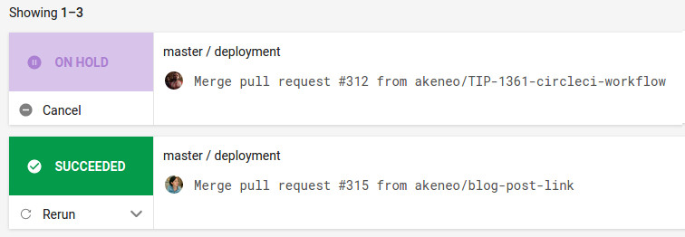
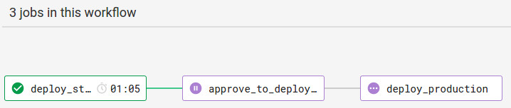

# Akeneo Help center
This repository holds the sources for our help center, made by hand with love.

**Install/preview the help center**

Install [Docker Engine](https://docs.docker.com/engine/installation/)

### Build with docker

```bash
make build
```

This is only building the documentation. The documentation is not available with this command, as it does not launch the HTTP server. 

### Build and launch HTTP server with docker

```bash
make watch
```

The help center website is then available on `http://localhost:8000/pim/serenity/`.
Files located in the content and src directories are watched for changes, so when developing or writing new articles you do not need to launch any other task.

## Deployment of the Serenity version

### With Circle CI (recommended)

Master branch is the Serenity version.

Once you merge a PR into the `Serenity` branch, it is automatically deployed on the staging server. In order to deploy it in production, please follow these steps:

- Check the staging environment if everything is ok to be deployed in production
- Open [the list of merged PR in master branch](https://circleci.com/gh/akeneo/workflows/pim-helpcenter/tree/master) in Circle CI. You have to be connected with your Github account.
- Click on the first row which should be "On hold"



- Click on the box "approve_to_deploy_in_production" and approve. It will launch the deployment in production.



- It's deployed in production in 1 minute!

### Local deployment (not recommended)

Your public SSH key should be deployed on the server (see Ansible configuration). It is strongly recommended to release with the CI process though.

```bash
HOSTNAME=xxx PORT=xxx make deploy
```

HOSTNAME is the server to deploy the documentation on.
PORT is the SSH port to connect to the server.

To know the production and staging environments of pim-helpcenter, please read the [inventory](https://github.com/akeneo/ansible/blob/master/inventories/core.inventory).

## Dropdown to choose the documentation version

The dropdown to choose the version of the documentation  is configured from a single file for every branches. The configuration of this dropdown is done in this [file] (https://github.com/akeneo/pim-helpcenter/blob/master/src/versions.json). **Only the configuration file `src/versions.json` of the `master` branch is deployed.** 

When you create a new branch from master, such as `v5`, don't forget to remove the deployment of this configuration file in the `v5` version. It is just one line to remove in the `deploy` step of the `Makefile`.

## Create a branch for a new major version

When you want to create a new major branch from the `master` branch, you have some modifications to do. Actually, all these operations have already been done to create the branch v4 from the master branch in this PR: https://github.com/akeneo/pim-helpcenter/pull/479.

You have to do the same to make it work correctly.

## Documentation contribution

It's right [here](https://github.com/akeneo/pim-helpcenter/wiki).
