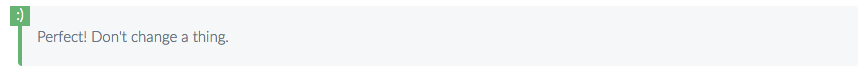
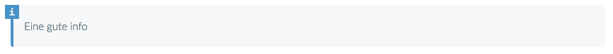
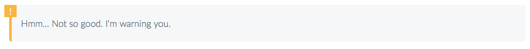
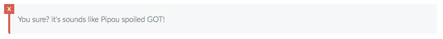
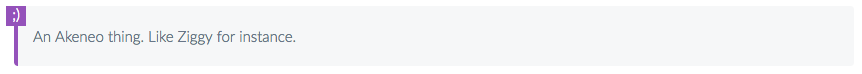
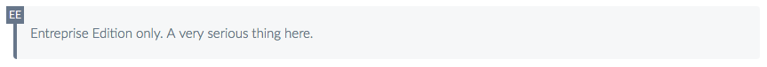

# Akeneo Help center
This repository holds the sources for our help center, made by hand with love.

## I wanna help you with the documentation!

You wanna give us a hand on trying to make the best documentation ever for our Julias and Peters? Great! Here is how.

First, a few things you should know. The help center is composed of articles that are gathered in themes. These themes are Julia's or Peter's themes, knowing Julia is our dear daily end-user, whereas Peter is in charge of setting the PIM up and is responsible for its smooth running.

### Let's talk about themes
You will find the themes in the files named `themes-for-julia.json` and `themes-for-peter.json` in the `content` folder.

If you take a look at one of this file, you will see that this is a very simple JSON. Its structure is the following:
- Each key is the identifier of a theme: It should be unique among all themes and it should only use lowercase with hyphens between words.
- Each theme has a title: It is the title used in the "Themes" pages.
- Each theme has a description: It is the description used in the "Themes" pages.

If you want to create a new theme, you just have to add a new key in one of the two files, depending on if this new theme will be more interesting for Julia or Peter. You can't put it in both files. You have to choose. Yeah, life is always about hard choices! :)

### Let's write a wonderful article
All articles are stored in Markdown files, that you will find in the `content/md` folder.

Are you familiar with [Markdown](https://en.wikipedia.org/wiki/Markdown)? If not, here is a good [cheatsheet](https://github.com/adam-p/markdown-here/wiki/Markdown-Cheatsheet) to make your first steps into this crazy world. Don't worry, it's easy.

So now you know everything about Markdown, you are ready to create your first article. As said earlier, you will find the articles in the `content/md` folder.

Create in this folder, a new file. You can create it wherever you want, even in newly created folders. As long as it is still in  `content/md`, you'll be fine.

If you want to create new folders, you can go crazy about the name, there is no limitation. This is not the case for the name of the file in itself. Please use lowercase with hyphens between words and don't forget that it will be a Markdown file so its extension should be `.md`.

At this stage, you should have a beautiful empty file. To add content, you have two choices:
- start from scratch: you're like a Help center articles hero master, so you don't need any help,
- use the `article-template.md` you'll find at the root of this repository.

In the first case, you don't need my help, so go ahead and add thousands of articles to our help center. We'll find a way to reward you.

In the second case, here is a small explanation on how the `article-template.md` works. First, this file should never be changed. You just need it to copy its content in your newly created Markdown file. Then, it works like a pattern, just fill in the blanks.

#### FILL THE HEADER
Each article has a header that contains several information. It's at the top of each article and it's surrounded by `---` blocks.
Here is a description of what we expect in each field.

**id**

The identifier of the article. 
- It should be unique among all articles. 
- In lowercase with hyphens between words. 
- It is mandatory as it is used when you want to reference this article in other articles and it is also used to build the URL path to this article.
- If you forget to give an id, your article will be ignored.

**themes**

The id of the themes to which the article belongs.
- One article can belong to zero to several themes.
- If it belongs to several themes, separate your themes' ids with comma. Example: `themes: my-theme-1, my-theme-2`
- If you don't want your article to be referenced in the help center, you just have to empty this field.

**title**

The title of the article.
- It is mandatory.
- It will appear at the top of the article and it will be used as links in the "Themes" pages and the popular section of homepage.
- You can put some words in bold inside the title by using the following syntax `**bold**`. If the first word of your title is a bold word, you will have to use quotes to make it work. Example: `title: "**Crazy** is this title"`

**popular**

Whether the article should appear in the "Popular article" section on the homepage or not.
- It is not mandatory, and false by default.

**ee-only**

Whether the article concerns only an Entreprise Edition feature or not.
- It will add a "EE" label nearby the links of this article, so you don't need to precise in the article's title that it's an EE article.
- It is not mandatory, and false by default.

**related**

The id of articles that are related to the current article and that you want to appear in the dedicated section "Related articles" at the end of the article.
- If the article is related to several articles, separate you articles' ids with comma. Example: `related: my-article-1, my-article-2`
- It is not mandatory. If empty, the "Related articles" section at the end of the article won't appear.

#### WRITE THE CONTENT
Once your header is completed, you can begin to write your article below the header.

It's classic Markdown and you've learned everything about it a couple of sections ago, so you should be fine.

We also added some extras to allow you even more customization and presentation effects. Wow!

Here is the list of what you can do.

**Amazing alert blocks**

```
::: success
Perfect! Don't change a thing.
:::
```


```
::: info
Eine gute info
:::
```


```
::: warning
Hmm... Not so good. I'm warning you.
:::
```


```
::: danger
You sure? it's sounds like Pipou spoiled GOT!
:::
```


```
::: tips
An Akeneo thing. Like Ziggy for instance.
:::
```


```
::: ee
Entreprise Edition only. A very serious thing here.
:::
```

**Emojis for the fun**


```
:) :tada: :wink:
```

Don't forget to use first level titles (`# My title`) inside your article so as the help center is able to build a summary of your article.

Wanna pimp your article with some beautiful images? Go ahead! We love them! First, add your image in the `content/img` folder. Then, use the following line in your markdown: ``
Images are automatically centered. You don't need to bother about that.

That's not enough? You also want to add some links to other articles? That's easy! Here: `[I want this to be a link](/articles/id-of-the-article.html)`.


### Excited to see the result?
To deploy on your own computer and see the result of your wonderful article, you will need to follow the "I wanna install/preview the help center!" section.

## I foud a typo or a problem in one of the articles!

You can help us get rid of this anomaly. 

Go in the `content/md` and search for the article where you found the problem. Then make the fixes you think are needed in the file.

If you are having a hard time with the Mardown file to understand how it works, take a look at the "Let's write a wonderful article" section.

To live view your changes, see the "I wanna install/preview the help center!" section.

## I wanna install/preview the help center!

First, you will need [Node](https://nodejs.org/en/) as well as [Gulp-cli](https://github.com/gulpjs/gulp-cli).

Then you can run the following commands in your terminal where these sources are:
```bash
sudo npm install --global n
sudo n 7.2.0
npm install
sudo npm install --global gulp-cli
```

### Run locally
Once Node and gulp-cli installed, run:

```bash
npm install

gulp serve
```

The help center website is then available on `localhost:8000`.
Files located in the content and src directories are watched for changes, so when developing or writing new articles you do not need to launch any other task.
