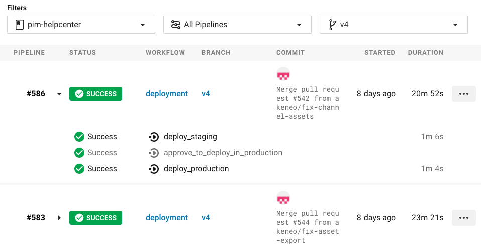
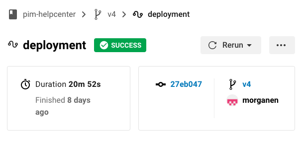

# Akeneo Help center
This repository holds the sources for our help center, made by hand with love.

**Install/preview the help center**

Install [Docker Engine](https://docs.docker.com/engine/installation/)

### Build with docker

```bash
make build
```

This is only building the documentation. The documentation is not available with this command, as it does not launch the HTTP server. 

### Build and launch HTTP server with docker

```bash
make watch
```

The help center website is then available on `http://localhost:8000/pim/v3/`.
Files located in the content and src directories are watched for changes, so when developing or writing new articles you do not need to launch any other task.

## Deployment of the documentation for the PIM 3.x

### Automatic

The `v3` branch is the documentation of the PIM 3.x.

Once you merge a PR into the `v3` branch, it is automatically deployed on the production server, hence updating the documentation for the PIM 3.x. You have nothing to do.

### Manual

In case you want to re deploy the documentation of the v3, [look at the latest merge in the `v3` branch](https://app.circleci.com/pipelines/github/akeneo/pim-helpcenter?branch=v3) and click on _Deployment_.



Then click on _Rerun_.



## Dropdown to choose the documentation version

The dropdown to choose the version of the documentation  is configured from a single file for every branches. The configuration of this dropdown is done in this [file] (https://github.com/akeneo/pim-helpcenter/blob/master/src/versions.json). **Only the configuration file `src/versions.json` of the `master` branch is deployed.** 

When you create a new branch from master, such as `v4`, don't forget to remove the deployment of this configuration file in the `v4` version. It is just one line to remove in the `deploy` step of the `Makefile`.

## Documentation contribution

It's right [here](https://github.com/akeneo/pim-helpcenter/wiki).
