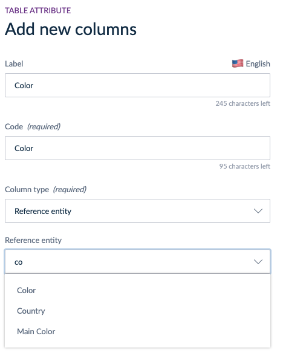

# Reference Entities in Table Attribute
::: meta-data type="New" features="Governance" available="Late-January" in="EE"

To really benefit from Akeneo PIM data structure, it is now possible to use Reference Entities as a column type in your table attributes. Imagine you have your colors listed as records in a reference entity, you can use them as options in your table in a couple of clicks! Quite a time saver!

  

::: more
[What is table attribute?](../articles/manage-multidimensional-data-in-a-table.html)
:::
