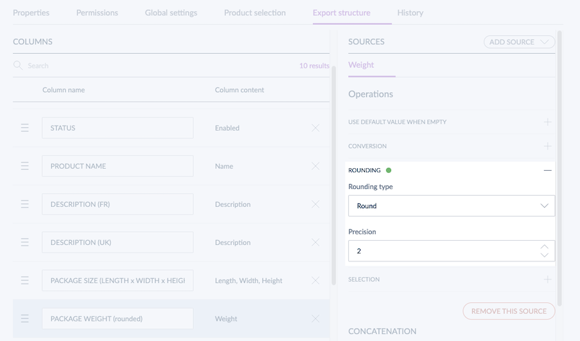

# Round measurements in your Tailored Exports
::: meta-data type="New" features="Productivity" available="January" in="EE,GE" link-to-doc="../articles/tailored-export.html#discover-operations"

Improve the readability of your product information exports by defining rounding operations for your measurement values! Decide if you want the values to be rounded, rounded up or rounded down. You can also set the number of digits after the separator. Lighter and more product precise product data will be greatly appreciated.

  

::: more
[What is a Tailored Export?](../articles/tailored-export.html)
:::
