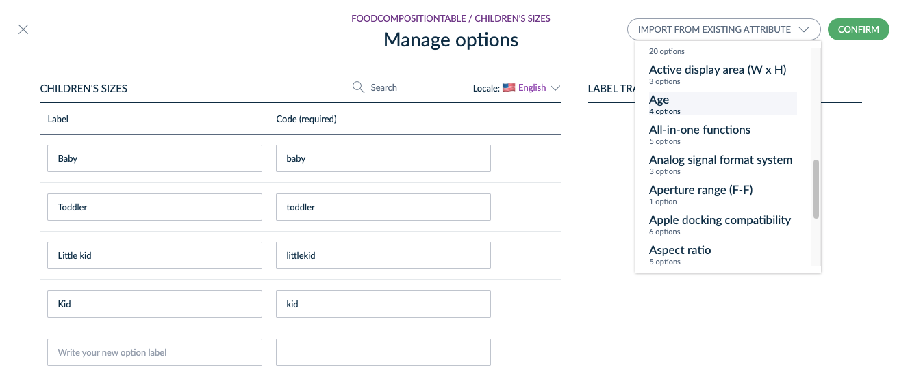

# Use Existing Options in Table Attributes
::: meta-data type="New" features="Productivity" available="February" in="EE,GE"

Creating a Table Attribute has never been easier. With the ability to import options from an existing attribute, you’ll save time when creating your table. For example, if you are creating a Food Composition table, and you already have a list of ingredients under an existing attribute. You can now import the options from that attribute, like sugar or flour, in order to create the options for that new label.

::: more
[What is a Table Attribute](../articles/manage-multidimensional-data-in-a-table.html)
:::
