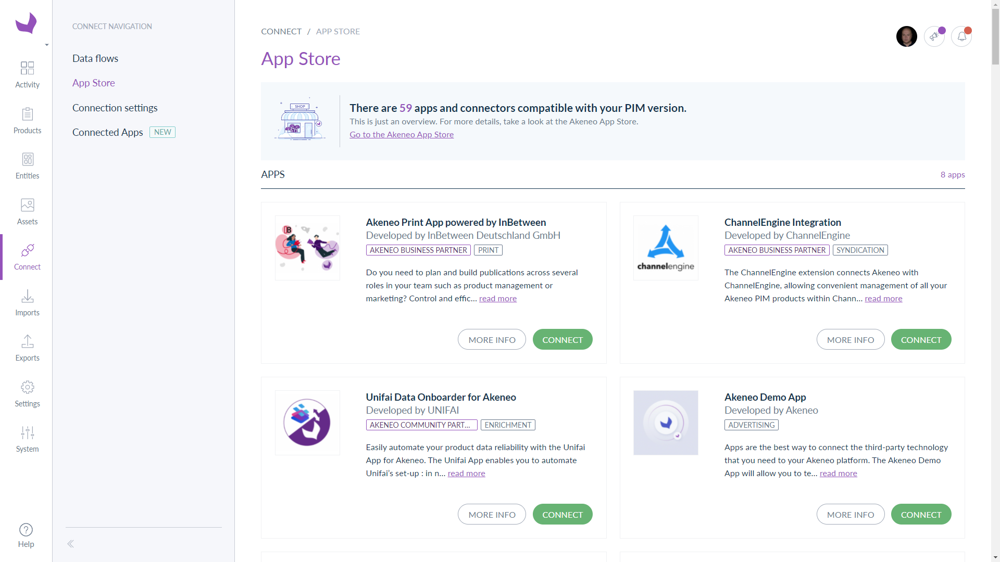

# Akeneo App Store
::: meta-data type="New" features="Connectivity" available="mid-March" in="EE,GE" link-to-doc="../articles/how-to-connect-my-pim-with-apps.html"

Introducing the next generation of connectivity with Akeneo PIM: Apps and Akeneo App Store. Right from the Connect navigation tab you will see the App Store where you can discover, browse and connect with trusted Apps. With just a few clicks you can connect your existing technology stack or extend Akeneo PIM in exciting new ways. There are several new Apps for you to try today, with more to come. From the Connected Apps screen you can also access, manage and configure your installed Apps. A whole new world of connectivity has just opened up to you.

::: more
[How to Connect My PIM with Apps](../articles/how-to-connect-my-pim-with-apps.html)
:::
