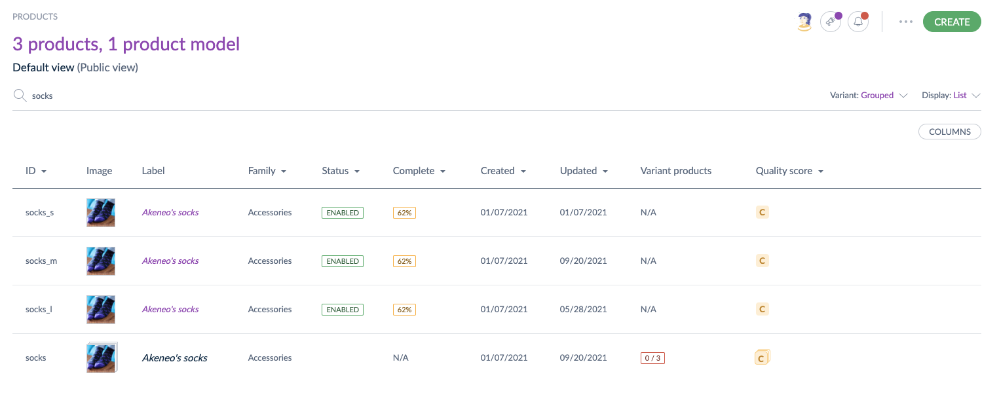

# Quality Score and Product Models
::: meta-data type="Improvement" features="Data Quality" available="March" in="EE,GE" link-to-doc="../articles/understand-data-quality.html"

If you're working with product variants in Akeneo PIM, you will be happy to hear that the Quality Score for your product models and sub models are now taken into account too. The Quality Score for product models will be visible from the product grid and product edit form, and your dashboard will factor in models, variants, and simple products for each of the key indicators. You can also filter product models based on quality when exporting, including via Tailored Exports and the API. Quality stuff!

::: more
[Learn about product models](../articles/what-about-products-variants.html#how-many-levels-of-enrichment-are-managed)
:::
