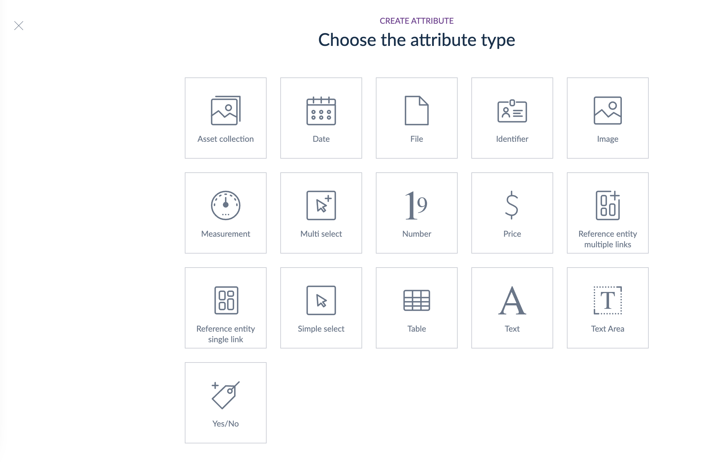

# Reference Data Removed
::: meta-data type="Improvement" features="Productivity" available="mid-April" in="EE,GE" link-to-doc="../articles/what-is-an-attribute.html#differences-between-the-two-attribute-types.html"

Before the time of Reference Entities, a pesky attribute remained, called the Reference Data attribute. It created a bit of clutter and confusion, so in the spirit of spring cleaning we've hidden the ability to create reference data via the attribute creation modal. That means as a Growth Edition customer you'll have a smoother experience and our Enterprise SaaS customers never have to spend time determining the differences between reference data attributes and reference entities.

::: more
[How to use reference entities](../articles/manage-reference-entities.html)
:::
