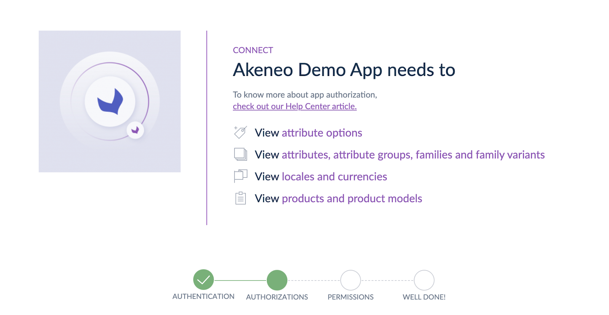

# App Authorization Notifications
::: meta-data type="Improvement" features="Apps, Connectivity" available="mid-May" in="EE,GE"

While you’re installing an App from the Akeneo App Store, you will be asked to grant access to your user information or to parts of your PIM like catalog structure, products, assets, reference entities, etc. Once connected, your apps may need additional authorization. With this release, a notification will pop up for users that manage the App alerting them to grant the new authorizations, making this seamless and secure.

::: more
[How to Connect my PIM with Apps](../articles/how-to-connect-my-pim-with-apps.html)
:::
