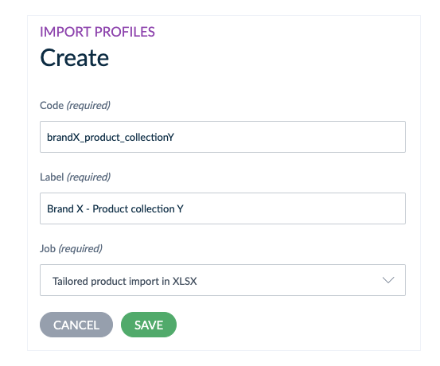

# Tailored Imports
::: meta-data type="New" features="Productivity" available="late-June" in="EE,GE"

Importing data into Akeneo PIM is imperative to your PXM workflows. With Tailored Imports you can easily transform, map and import data files that don't match your Akeneo PIM catalog structure. This saves you from doing manual and tedious data prep work in spreadsheets. Now you can map your sources to your Akeneo attributes, and voila! You're ready to import virtually any file structure you receive.

::: more
[Import Your Data](../articles/how-to-connect-my-pim-with-apps.html)
:::
