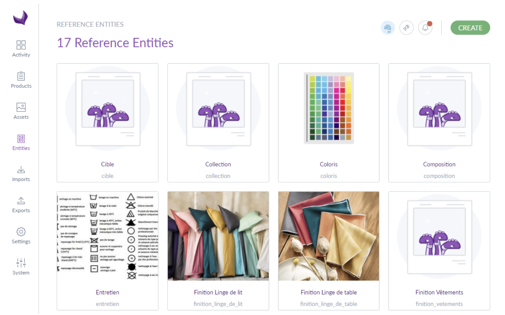

# Tailored Imports supports more attribute types
::: meta-data type="Improvement" features="Productivity" available="July" in="EE" link-to-doc="../articles/tailored-import.html"

Tailored Imports allows you to easily transform, map, and import data files that don't match your Akeneo PIM catalog structure. Now you can map columns in your source data to additional attribute types in your Akeneo PIM. These types include multiple-link Reference Entities and single-link Reference Entities, as well as Asset Collections. This helps by offering smoother mapping and faster importing.

::: more
[Manage your Reference Entities](../articles/manage-reference-entities.html#mainContent)
:::
