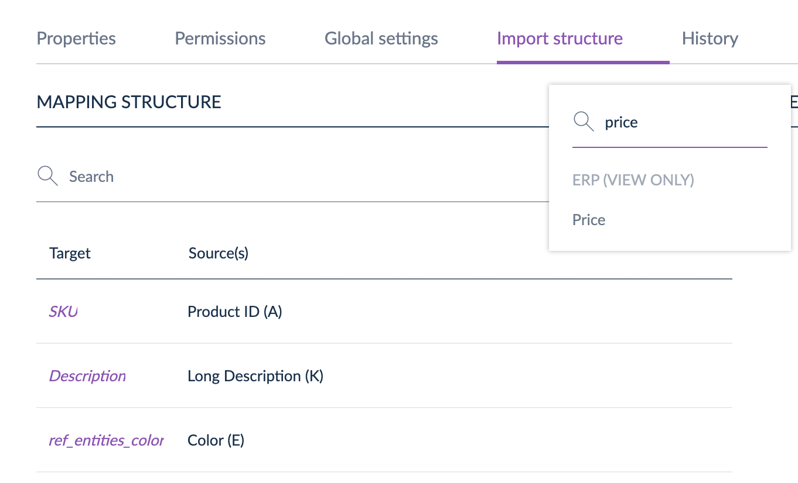

# Tailored Imports Supports Price Attributes
::: meta-data type="Improvement" features="Productivity" available="Late August" in="EE,GE"

We have expanded the ability to import your data into Akeneo PIM by adding an additional attribute type: the price attribute. So whether it’s your MSRP, MAP, Sales Price or other standard prices you store in Akeneo PIM, you can use Tailored Imports to map it to the correct price attribute source for easy uploading.

::: more
[Learn about the different attribute types](../articles/what-is-an-attribute.html#akeneo-attribute-types)
:::
