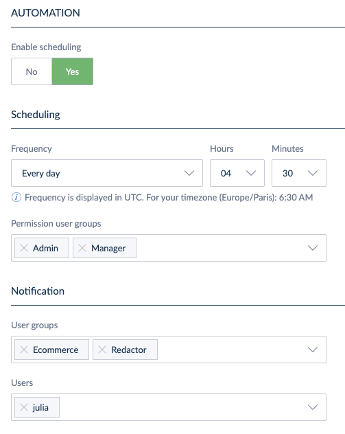

# Automate SFTP Imports and Exports
::: meta-data type="New" features="Productivity" available="September" in="EE,GE"

Connect your product imports and exports to remote SFTP storage servers to securely transfer your data to and from Akeneo PIM. Simplify and streamline the import and export of data by using the Properties tab to turn on automation and run jobs on an automated, predefined schedule.

::: more
[Learn about scheduling your jobs](../articles/import-export-automation.html#schedule-and-automate-your-importexport-profile)
:::
