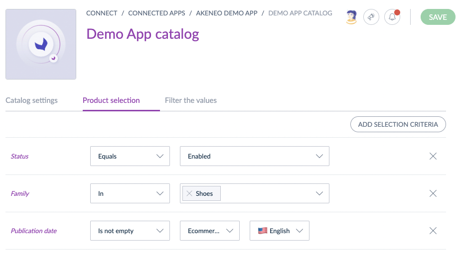

# Catalogs for Apps
::: meta-data type="New" features="Connectivity" available="Late September" in="EE,GE" link-to-doc="../articles/how-to-connect-my-pim-with-apps.html#how-to-configure-catalogs-for-apps"

Catalogs for apps allows you to configure which products you want to share with an app. Determine the product selection that you want to distribute to you app by utilizing one or several criteria as filters. When an app uses catalogs to retrieve product data, it automatically enables the Catalogs tab and creates catalogs for this app in Akeneo PIM. Configuring these will help you distribute product data to your apps with more ease than ever before.

::: more
[What is an app?](../articles/how-to-connect-my-pim-with-apps.html#what-is-an-app)
:::
