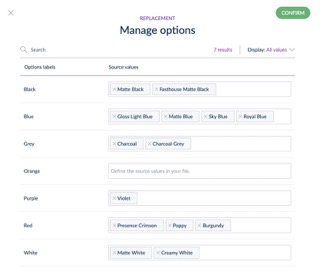

# Reference Entity Replacement Operations via Tailored Imports
::: meta-data type="New" features="Productivity" available="October" in="EE,GE"

Reduce manual work by mapping values in an import file to reference entities in Akeneo PIM. A common use case for this functionality is the need to update colors in a supplier’s file to match the color names in Akeneo PIM. For example, your supplier may use color names such as “sky blue” or “royal blue” but you need the color to be “blue” to align with your product catalog. It would be time-consuming to manually update every color value in a spreadsheet. Save time by using Tailored Imports to map the supplier’s color names to your desired color name with the new replacement options for reference entity single link or reference entity multiple link attributes. 

::: more
[Learn about Tailored Imports](../articles/tailored-import.html#overview)
:::
