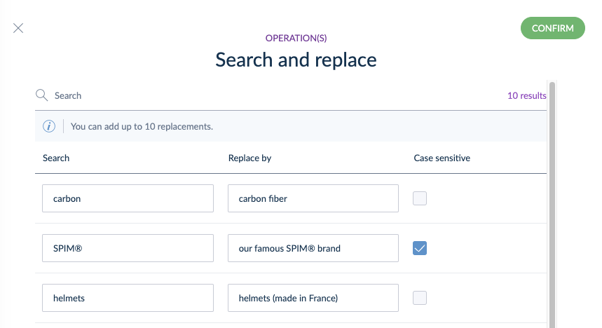

# Search and Replace Functionality in Tailored Imports
::: meta-data type="New" features="Productivity" available="November" in="EE,GE" link-to-doc="../articles/tailored-import.html#search-and-replace"

Now you can easily find and replace specific words in Text and Text Area attributes in Tailored Imports. Add up to ten replacement words at a time and spend less time manually editing your files before importing them.

::: more
[Learn about Tailored Imports](../articles/tailored-import.html#overview)
:::
