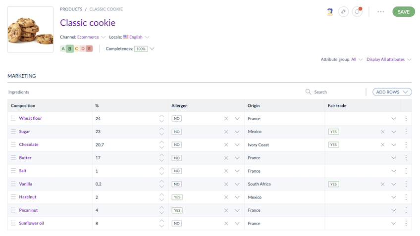

# Manage your Multidimensional Data in Akeneo PIM
::: meta-data type="New" ee-only="trje" link-to-doc="../articles/manage-multidimensional-data-in-a-table.html#the-title-anchor"
:::

Structuring and adding product dimensions, nutritional facts, ingredients, or packaging information to your product pages directly from your PIM is now easy and user-friendly! Discover Akeneo's new feature Table Attribute, choose one of the existing templates, or build your own from scratch. Once your table is ready and populated, use advanced search filters to find your products more easily. The most complex product data models can be directly built and used within Akeneo PIM!

::: info
[Import and Export your Table Attributes](../articles/manage-multidimensional-data-in-a-table.html)
:::
