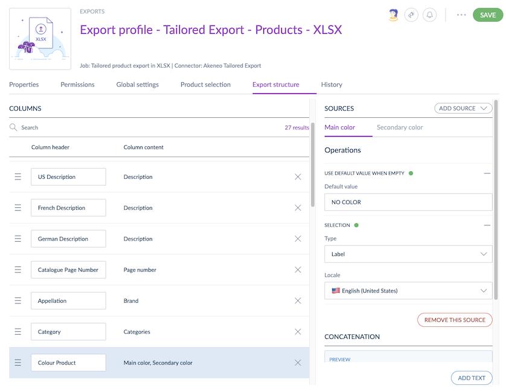

# Advanced Product Exports with Tailored Exports
::: meta-data type="New" ee-only="true" link-to-doc="../articles/tailored-export.html"
:::

We are pleased to introduce a new export feature called Tailored Exports. From your export jobs, Tailored Exports allow you to customize your product export structure, content and sources. Thanks to Tailored Exports, you can now easily create and export XLSX or CSV files to match your needs, or your stakeholders' needs, or the requirements of a specific channel. Its interface enables you to easily define, select, rename and reorder columns, without having to manipulate the data further once exported.

