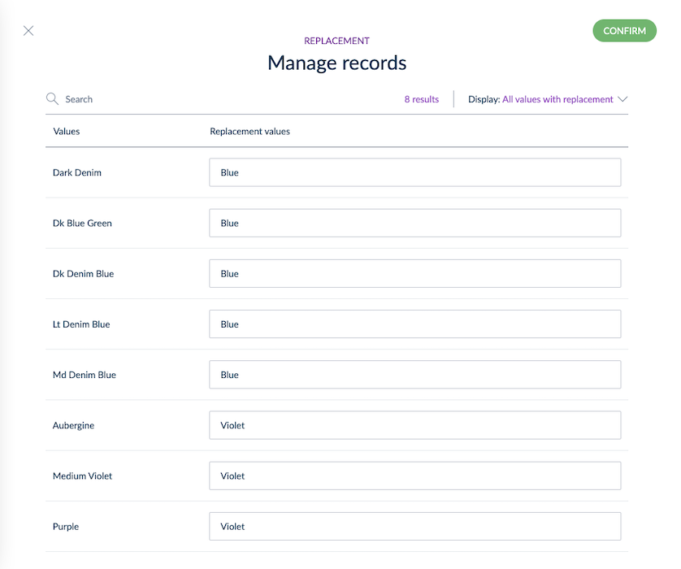

# Advanced Operations for Tailored Exports
::: meta-data type="Improvement" ee-only="true" link-to-doc="../articles/tailored-export.html#discover-operations"
:::

Tailored Exports operations allows you to create the most meaningful data files for your stakeholders by adapting your Akeneo PIM values in different ways when exporting them. These include:
- Replacement
- Concatenation
- Default values
- Conversions
- Rounding
- Cleaning HTML tags

::: info
[Learn about all of them here](../articles/tailored-export.html#discover-operations)
:::
