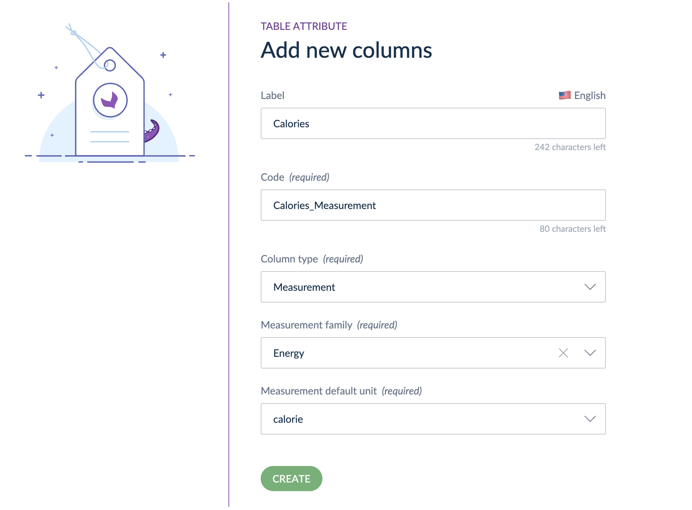

# Measurements in Table Attributes
::: meta-data type="New" features="Productivity" available="February" in="EE,GE" link-to-doc="../articles/manage-multidimensional-data-in-a-table.html#measurement-column-type"

Take advantage of measurements when building table attributes. This is particularly helpful when creating tables with dimensions. Next time you need a table to display your product and package dimensions utilize width, length, and height and select your desired unit of measurement.

::: more
[What is a Table Attribute](../articles/manage-multidimensional-data-in-a-table.html)
:::
