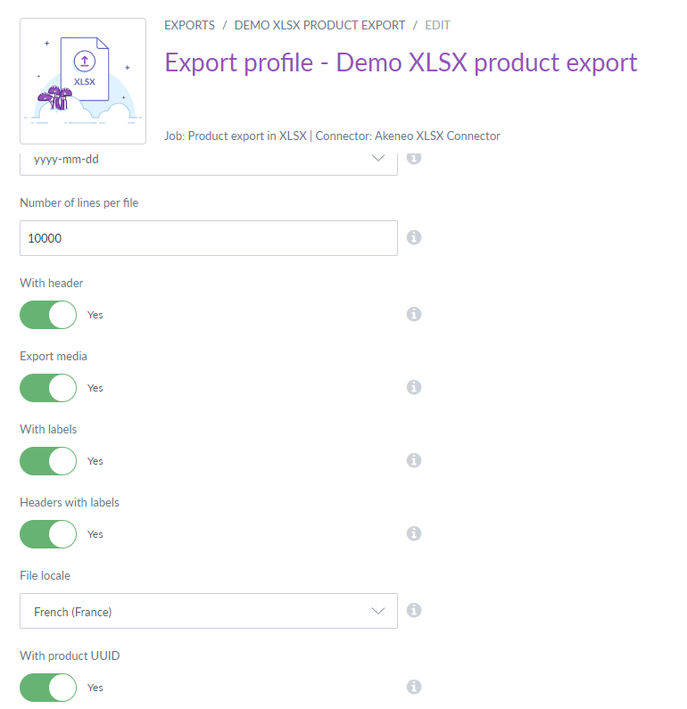

# Products imports & exports compatible with UUID
::: meta-data type="New" features="Productivity" available="November" in="EE,GE" link-to-doc="../articles/manage-product-identifiers.html"

You can include a column for the UUID identifier when exporting products from Akeneo PIM.  All products in Akeneo PIM are assigned a UUID so including the UUID column in an export file will make it easy to update products if you need to re-import the file back into Akeneo PIM. The UUID column is hidden by default. This column may be added to exports by  turning on the “export with product UUID option” to update the export profile. When the export with product UUID option is activated associated products and exported media files will be displayed with the UUID identifier instead of the SKU attribute.

::: more
[Read more about updating export profiles](../articles/exports.html#update-an-export-profile)
:::