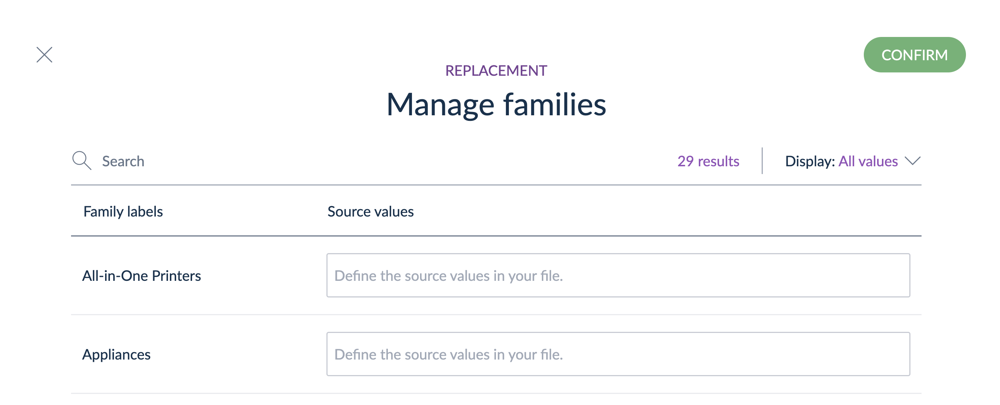

# Replace Families and Change Cases with Tailored Imports
::: meta-data type="Improvement" features="Productivity" available="Late August" in="EE,GE" link-to-doc="../articles/tailored-import.html"

Make importing data into your Akeneo PIM even easier with the expanded functionality of Tailored Imports. First, with the family replacement operation you can replace your source data to match the correct family in Akeneo PIM. For example, if your source data categorizes your printers as 'Printers,' you can use the family replacement operation to assign any products labeled 'Printers' to be 'All-in-One Printers' to match the correct family. Next up, you can utilize the change case operation to do exactly as it says -- to change the case of your text values to match your data! Uploading a file that has values in all lower case? Use the change case functionality to capitalize them. With additional operations you'll save time and the headache of manual data cleansing.

::: more
[Learn about the different attribute types](../articles/what-is-an-attribute.html#akeneo-attribute-types)
:::