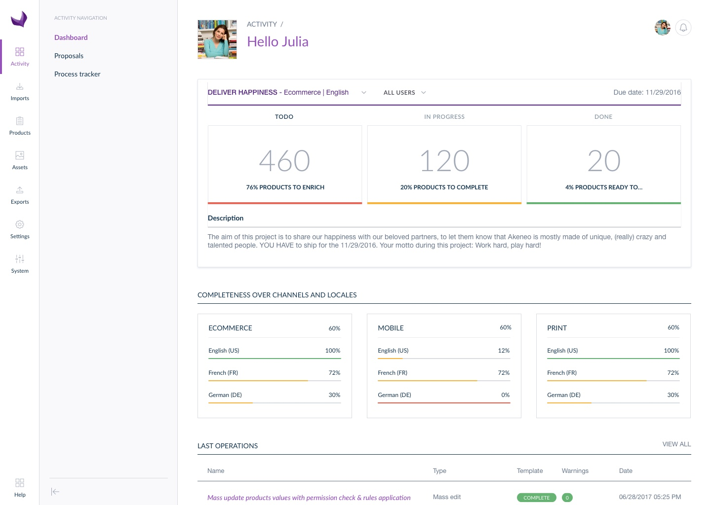

# Manage rules (Enterprise Edition only)

## What is a rule?

Akeneo Enterprise Edition comes with a rule engine. The rule engine allows you to product’s enrichment automatic actions based on conditions.

For instance, you can ask the system to automatically copy values between attributes, to categorize products or assign families.

The feature comes with a set of actions and conditions, for each version, the engine rule is improved. Moreover you can also create your own rules, to do so refer to our technical documentation: [How to add a custom action in the rule engine](https://docs.akeneo.com/1.7/cookbook/rule/add_custom_action_rule_engine.html).

## How to create a rule

Rules are exclusively created by YML imports. You need create your YML file like explained on our online documentation: [General information about rule format](https://docs.akeneo.com/1.7/cookbook/rule/general_information_on_rule_format.html#enrichment-rule-structure) and import it in the PIM using the import job “Rule import in YML”.

For more details about how to execute an import, please refer to the end-user guide, section «Imports & Exports».

You can also export your rules: to do so, execute the export job “Rule export in YML”.

> **Note**  
  For more details about how to execute an export, please refer to the user guide “user”, section “Launch an export”.

## View all rules

The screen Settings/Rules displays all rules created which apply on attributes, categories, system attributes (status, completeness...).

## Calculate the number of affected products for rules

To help you to validate your rules and well define your rules conditions, you can calculate the number of matching products that the rule will affect.

The fist time a rule is executed, it can match many products. The next times, you might have 0 matching products or only few:

To use this action, select one or several rules by ticking them on the left side of the screen, then click on “Bulk actions” and select “Calculate the affected products”. Then confirm the action in the pop in.

A flash message confirming the action will be displayed and you will be notified once the calculation is done. The number of affected products will appear on the right side of your screen.

## Delete rules

### To delete a single rule

To delete a rule, click on the “Delete” button at the end of each line in the datagrid.

A confirmation message validates the action of deleting a rule.

A deleted rule can no longer be executed by the rules engine. The products keep the values calculated by the deleted rule.

> **Note**  
  If you do not see the button “Delete” you do not have the appropriate rights to delete a rule. Please contact your administrator to change your rights.

## Delete a selection of rules

**You can also delete several rules at the same time:**
1.  Select the rules you want to delete
1.  Click on the bulk action menu
1.  Select «Delete the selected rules»

A confirmation message validates the action of deleting a rselection of rules.

## Execute a rule

In order to allow you to execute rules on your own, we have added an «Execute rule» action on this page. You can simply select rules and click on the top right corner button or use the bulk actions menu.

**You can execute:**
*   one specific rule,
*   a selection of rules,
*   all your rules (be aware, this action could take a long time).

